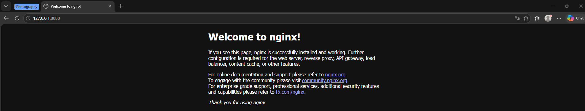
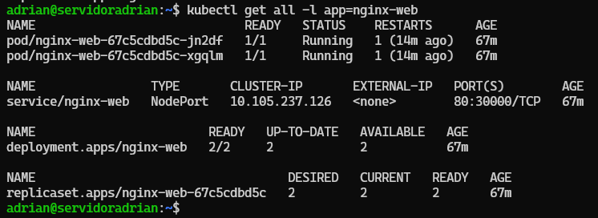
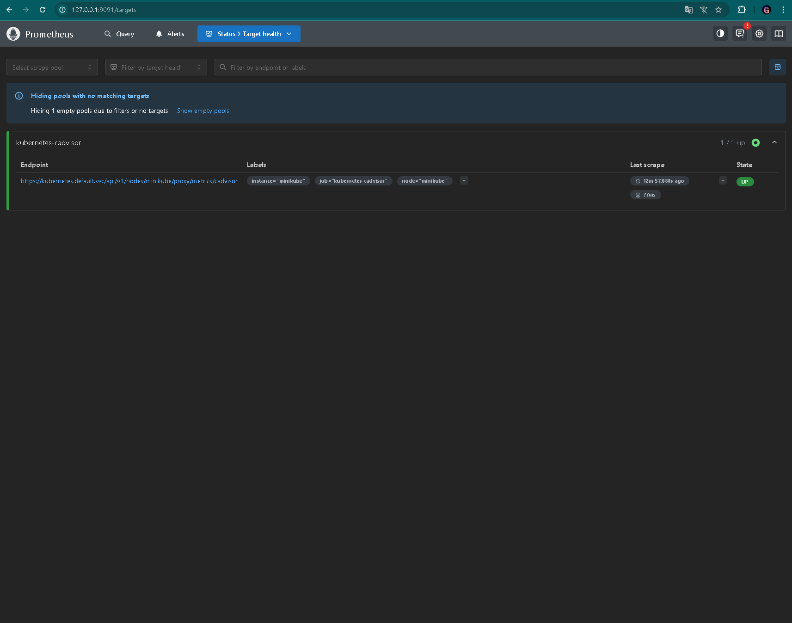
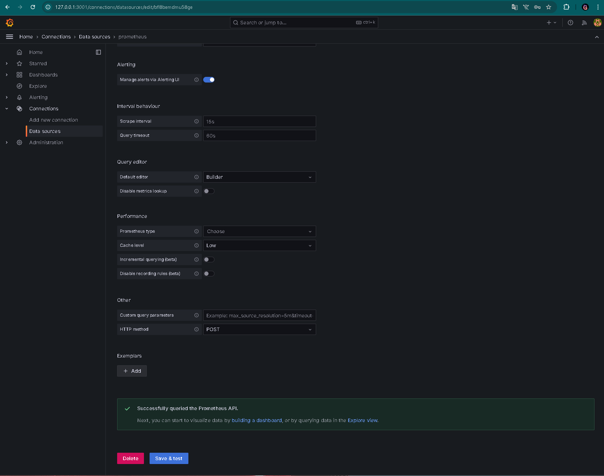
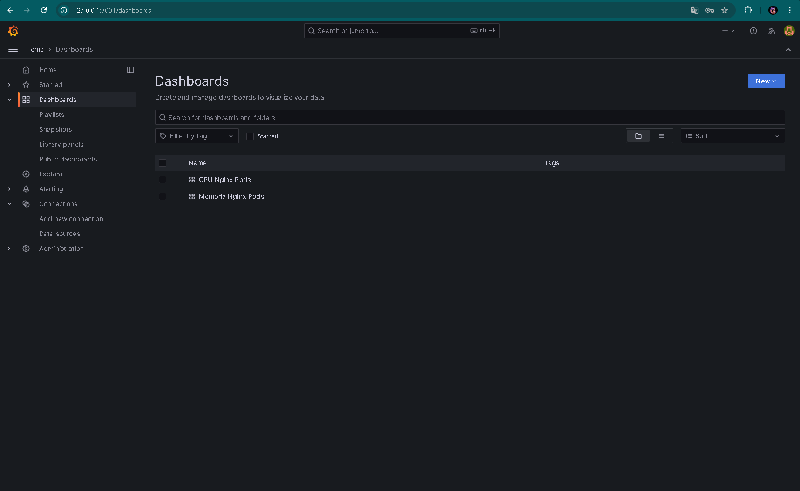
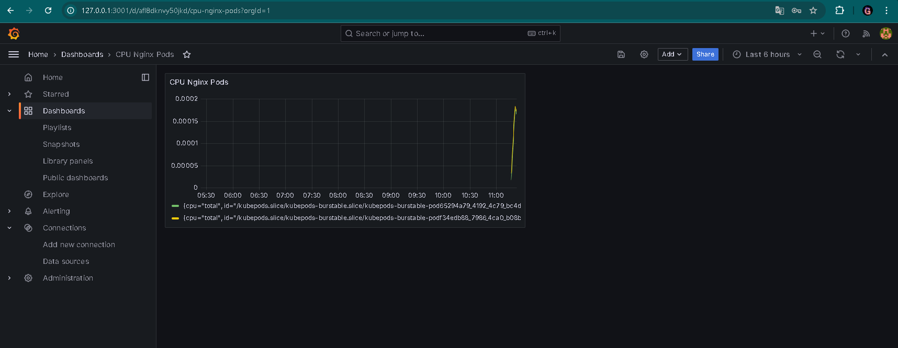
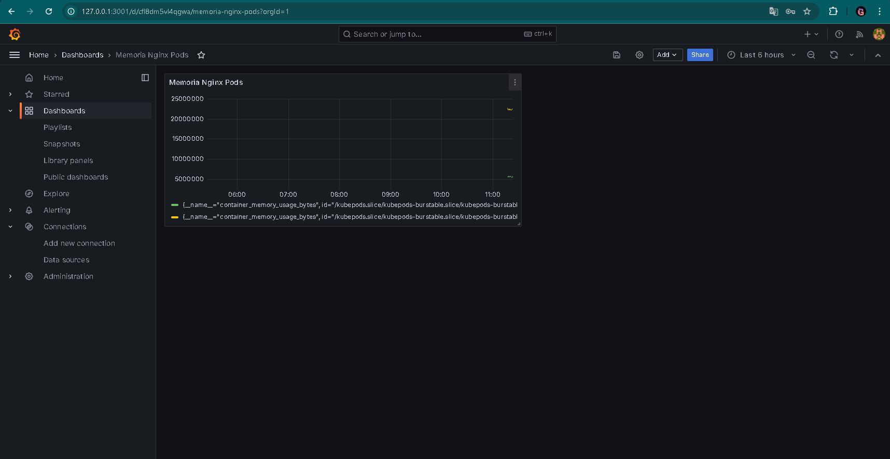
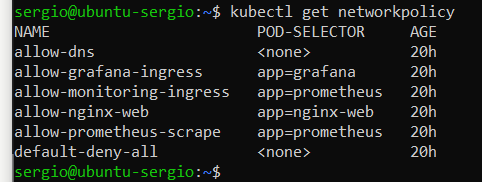
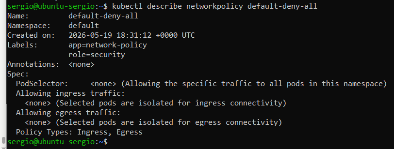
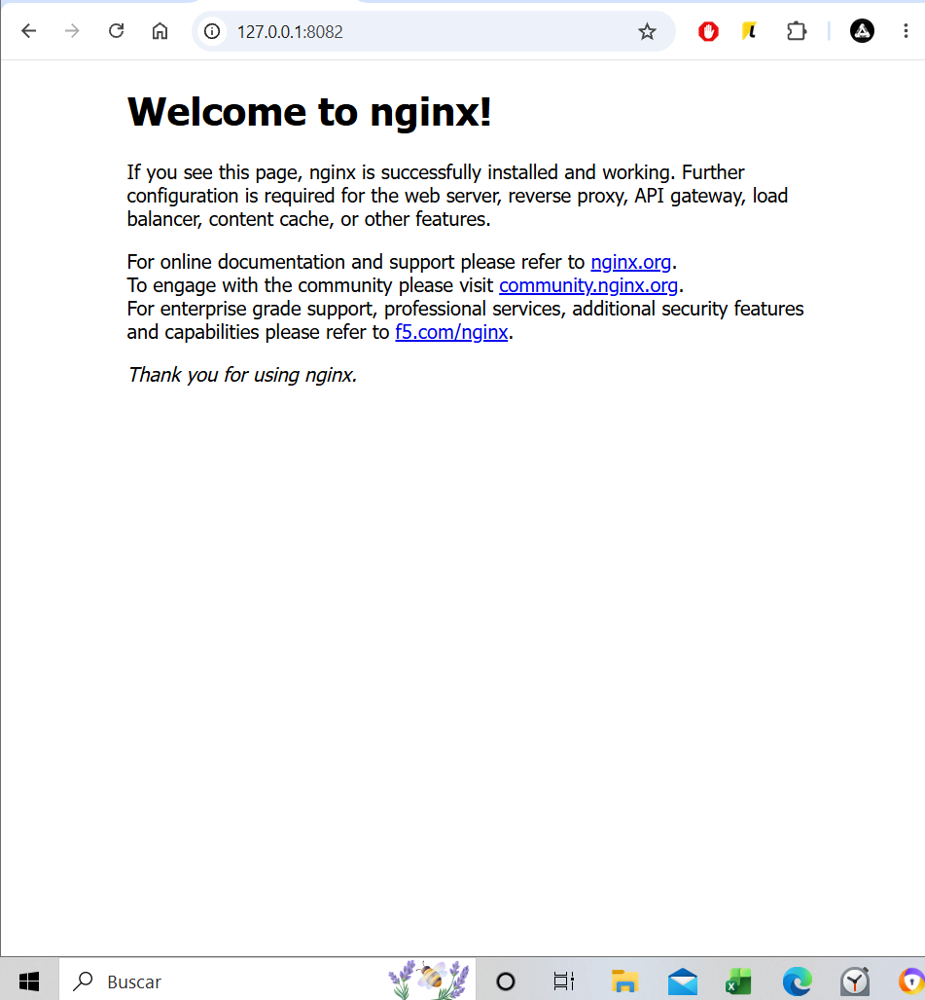

# Memoria Técnica del Proyecto Intermodular ASIR

**Título:** Implantación de un Entorno Kubernetes Local con Aplicación Web Escalable y Monitoreo en Tiempo Real

| | |
|---|---|
| **Curso** | 2.º ASIR — 2025/2026 |
| **Módulos** | SRI, SAD, ASO |
| **Fecha** | Mayo 2026 |

---

## Equipo de Trabajo

| Integrante | Rol | Responsabilidades |
|---|---|---|
| Adrián Boza Suárez | Infraestructura y Despliegue | Minikube, Deployment Nginx, Service, alta disponibilidad |
| Santiago Pérez Cano | Monitoreo y Observabilidad | Prometheus, Grafana, dashboard, scraping de métricas |
| Sergio López Pérez | Seguridad y Documentación | NetworkPolicies, documentación técnica, defensa oral |

---

## Índice

1. [Resumen Ejecutivo](#1-resumen-ejecutivo)
2. [Objetivos](#2-objetivos)
3. [Stack Tecnológico](#3-stack-tecnológico)
4. [Arquitectura del Sistema](#4-arquitectura-del-sistema)
5. [Fases de Implementación](#5-fases-de-implementación)
   - 5.1. Fase 1: Infraestructura y Aplicación Web
   - 5.2. Fase 2: Monitorización
   - 5.3. Fase 3: Seguridad de Red
6. [Resultados y Verificación](#6-resultados-y-verificación)
7. [Problemas Encontrados y Soluciones](#7-problemas-encontrados-y-soluciones)
8. [Relación con los Módulos de ASIR](#8-relación-con-los-módulos-de-asir)
9. [Conclusiones](#9-conclusiones)
10. [Mejoras Futuras](#10-mejoras-futuras)

---

## 1. Resumen Ejecutivo

Este proyecto consiste en la implantación de un clúster Kubernetes local mediante Minikube sobre una máquina virtual Ubuntu Server 24.04 LTS ejecutada en VirtualBox. El sistema despliega una aplicación web Nginx con alta disponibilidad (2 réplicas), un stack completo de monitorización con Prometheus y Grafana, y políticas de seguridad de red que siguen el modelo zero-trust.

Todo el proyecto se gestiona mediante infraestructura como código (IaC): los manifiestos YAML están versionados en Git, lo que garantiza reproducibilidad, auditoría y reversibilidad. El proyecto está diseñado para ejecutarse en un portátil con recursos limitados (2GB RAM, 2 CPUs), simulando a pequeña escala el flujo de trabajo de un equipo DevOps en una empresa tecnológica.

---

## 2. Objetivos

### Objetivo General

Implementar un entorno Kubernetes funcional que despliegue una aplicación web con monitorización y seguridad, utilizando exclusivamente herramientas gratuitas y ejecutable en un ordenador personal.

### Objetivos Específicos

1. **OE1:** Configurar un clúster Kubernetes con Minikube sobre Ubuntu Server en VirtualBox.
2. **OE2:** Desplegar una aplicación web Nginx con alta disponibilidad (2 réplicas) y auto-recuperación mediante health checks.
3. **OE3:** Implementar un sistema de monitorización con Prometheus (recopilación de métricas) y Grafana (visualización mediante dashboards).
4. **OE4:** Aplicar políticas de seguridad de red con modelo zero-trust utilizando NetworkPolicies de Kubernetes.
5. **OE5:** Verificar el correcto funcionamiento del sistema mediante pruebas de conectividad, alta disponibilidad y monitorización.
6. **OE6:** Documentar todo el proceso para su reproducción y evaluación.

---

## 3. Stack Tecnológico

| Componente | Tecnología | Versión | Propósito |
|---|---|---|---|
| Hipervisor | VirtualBox | 7.x | Virtualización de la VM |
| SO Invitado | Ubuntu Server | 24.04 LTS | Sistema base para el clúster |
| Contenedores | Docker Engine | Latest | Runtime de contenedores para Minikube |
| Orquestador | Minikube | v1.38.1 | Entorno Kubernetes de un solo nodo |
| API de Kubernetes | kubectl | v1.35.1 | CLI para gestionar el clúster |
| App Web | Nginx | Latest | Servidor web de ejemplo |
| Métricas | Prometheus | Latest | Recopilación y almacenamiento de métricas |
| Dashboards | Grafana | 10.4.3 | Visualización de métricas con dashboards |
| Control de versiones | Git + GitHub | — | Versionado de manifiestos y documentación |

### Justificación de la elección tecnológica

- **Minikube frente a kind/k3s:** Minikube es el estándar en el ámbito educativo de ASIR por su facilidad de uso, documentación extensa y soporte multiplataforma. Además, es el que se ha utilizado durante el curso.
- **Nginx frente a otras alternativas:** Es el servidor web más utilizado a nivel mundial (~30% de los sitios web). Ligero, probado y con imagen oficial en Docker Hub.
- **Prometheus + Grafana:** Es el stack de monitorización de facto en el ecosistema cloud-native. Prometheus está incubado por la CNCF y Grafana es el estándar para dashboards.
- **VirtualBox frente a alternativas:** Gratuito, multiplataforma y el utilizado en el aula de ASIR.

---

## 4. Arquitectura del Sistema

```
Windows 10/11 (Host)
│
└── VirtualBox (NAT + Port Forwarding)
    └── Ubuntu Server 24.04 LTS
        │   Recursos: 2 vCPU, 2GB RAM, 25GB disco
        │
        └── Docker Engine (runtime de contenedores)
            │
            └── Minikube (Kubernetes 1 nodo)
                │
                └── Namespace: default
                    │
                    ├── [Deployment] nginx-web (2 réplicas)
                    │   ├── Pod: nginx-web-xxx (app: nginx-web)
                    │   └── Pod: nginx-web-yyy (app: nginx-web)
                    │   └── LivenessProbe: HTTP GET / :80 (cada 10s)
                    │   └── ReadinessProbe: HTTP GET / :80 (cada 5s)
                    │
                    ├── [Service] nginx-web
                    │   └── NodePort 80:30000 → localhost:8080
                    │
                    ├── [Deployment] prometheus (1 réplica)
                    │   └── ServiceAccount + ClusterRole + ClusterRoleBinding
                    │   └── ConfigMap con targets de scraping
                    │       ├── kubernetes-pods (auto-descubrimiento)
                    │       └── kubernetes-cadvisor (métricas de nodo)
                    │
                    ├── [Service] prometheus
                    │   └── NodePort 9090:31000 → localhost:9090
                    │
                    ├── [Deployment] grafana (1 réplica)
                    │   └── Datasource: http://prometheus:9090
                    │   └── Dashboard: Prometheus 2.0 Overview (ID 3662)
                    │
                    ├── [Service] grafana
                    │   └── NodePort 3000:32000 → localhost:3000
                    │
                    └── [NetworkPolicies] 5 reglas
                        ├── default-deny-all
                        ├── allow-nginx-web
                        ├── allow-monitoring-ingress
                        ├── allow-prometheus-scrape
                        └── allow-dns
```

### Puertos NAT (VirtualBox)

| Servicio | Puerto Anfitrión | Puerto Invitado | Protocolo |
|---|---|---|---|
| SSH | 2222 | 22 | TCP |
| Nginx | 8080 | 30000 | TCP |
| Grafana | 3000 | 32000 | TCP |
| Prometheus | 9090 | 31000 | TCP |

---

## 5. Fases de Implementación

### 5.1. Fase 1: Infraestructura y Aplicación Web

**Responsable:** Adrián Boza Suárez

#### Preparación del entorno

Instalación de los prerrequisitos en la VM Ubuntu Server 24.04:

```bash
# Instalar Docker
sudo apt update && sudo apt install -y docker.io
sudo systemctl enable --now docker

# Instalar Minikube
curl -LO https://storage.googleapis.com/minikube/releases/latest/minikube-linux-amd64
sudo install minikube-linux-amd64 /usr/local/bin/minikube

# Instalar kubectl
curl -LO "https://dl.k8s.io/release/$(curl -L -s https://dl.k8s.io/release/stable.txt)/bin/linux/amd64/kubectl"
sudo install -o root -g root -m 0755 kubectl /usr/local/bin/kubectl

# Arrancar Minikube
minikube start --driver=docker --memory=2048 --cpus=2
```

#### Despliegue de Nginx

Fichero `manifests/app-web/deployment.yaml`:

```yaml
apiVersion: apps/v1
kind: Deployment
metadata:
  name: nginx-web
  labels:
    app: nginx-web
spec:
  replicas: 2
  selector:
    matchLabels:
      app: nginx-web
  template:
    metadata:
      labels:
        app: nginx-web
    spec:
      containers:
      - name: nginx
        image: nginx:latest
        ports:
        - containerPort: 80
        livenessProbe:
          httpGet:
            path: /
            port: 80
          initialDelaySeconds: 10
          periodSeconds: 10
        readinessProbe:
          httpGet:
            path: /
            port: 80
          initialDelaySeconds: 5
          periodSeconds: 5
        resources:
          requests:
            memory: "64Mi"
            cpu: "100m"
          limits:
            memory: "128Mi"
            cpu: "250m"
```

Puntos clave del diseño:
- **2 réplicas:** Garantizan alta disponibilidad. Si una falla, la otra sigue sirviendo.
- **LivenessProbe:** Kubernetes verifica cada 10s que Nginx responde HTTP 200. Si falla, reinicia el pod.
- **ReadinessProbe:** Kubernetes espera 5s antes de enviar tráfico al pod, asegurando que Nginx está listo.
- **Resources limits:** 128Mi RAM y 250m CPU por pod, evitando que un pod sature los recursos de la VM.

Fichero `manifests/app-web/service.yaml`:

```yaml
apiVersion: v1
kind: Service
metadata:
  name: nginx-web
  labels:
    app: nginx-web
spec:
  type: NodePort
  selector:
    app: nginx-web
  ports:
  - protocol: TCP
    port: 80
    targetPort: 80
    nodePort: 30000
```

- **NodePort 30000:** Expone Nginx fuera del clúster. Se accede desde el host mediante NAT (8080 → 30000).
- **Selector `app: nginx-web`:** Enruta el tráfico a los pods con esa etiqueta.

---

### 5.2. Fase 2: Monitorización

**Responsable:** Santiago Pérez Cano

#### Prometheus

Fichero `manifests/monitoring/prometheus.yaml` (contiene 6 recursos):

| Recurso | Descripción |
|---|---|
| ServiceAccount `prometheus` | Identidad para los pods de Prometheus |
| ClusterRole `prometheus` | Permisos de lectura sobre recursos del clúster (pods, services, endpoints, deployments) y acceso a /metrics |
| ClusterRoleBinding `prometheus` | Vincula la ServiceAccount con el ClusterRole |
| ConfigMap `prometheus-config` | Configuración de scraping con dos jobs: `kubernetes-pods` (auto-descubrimiento) y `kubernetes-cadvisor` (métricas del nodo) |
| Deployment `prometheus` | 1 réplica con imagen `prom/prometheus:latest`, monta el ConfigMap |
| Service `prometheus` | NodePort 31000, selector `app=prometheus role=monitoring` |

El scraping se realiza mediante:
1. **Auto-descubrimiento de pods:** Prometheus busca pods con anotaciones `prometheus.io/scrape: "true"` y los añade automáticamente como targets.
2. **cAdvisor:** Obtiene métricas de uso de CPU/memoria del nodo a través del proxy de la API de Kubernetes.

#### Grafana

Fichero `manifests/monitoring/grafana.yaml` (contiene 2 recursos):

| Recurso | Descripción |
|---|---|
| Deployment `grafana` | 1 réplica, imagen `grafana/grafana:10.4.3`, variables de entorno para login (admin/admin) y bind a 0.0.0.0 |
| Service `grafana` | NodePort 32000, selector `app=grafana role=monitoring` |

Configuración post-despliegue:
1. Acceso a Grafana: `http://localhost:3000` con credenciales `admin / admin`
2. Conexión del datasource Prometheus: URL `http://prometheus:9090` (nombre DNS interno del service)
3. Importación del dashboard **Prometheus 2.0 Overview** (ID 3662), que proporciona gráficos preconfigurados de:
   - Tasa de CPU
   - Uso de memoria
   - I/O de disco
   - Tráfico de red

---

### 5.3. Fase 3: Seguridad de Red

**Responsable:** Sergio López Pérez

Se implementaron 5 NetworkPolicies que siguen el modelo **zero-trust**: denegación total por defecto y apertura selectiva de puertos y protocolos.

Fichero `manifests/network/networkpolicy.yaml`:

#### Política 1: `default-deny-all`

```yaml
apiVersion: networking.k8s.io/v1
kind: NetworkPolicy
metadata:
  name: default-deny-all
spec:
  podSelector: {}
  policyTypes:
  - Ingress
  - Egress
```

- Afecta a todos los pods del namespace (`podSelector: {}`).
- Bloquea TODO el tráfico entrante y saliente.
- Es la base del modelo zero-trust: nada está permitido a menos que otra política lo autorice explícitamente.

#### Política 2: `allow-nginx-web`

```yaml
apiVersion: networking.k8s.io/v1
kind: NetworkPolicy
metadata:
  name: allow-nginx-web
spec:
  podSelector:
    matchLabels:
      app: nginx-web
  policyTypes:
  - Ingress
  ingress:
  - from: []
    ports:
    - protocol: TCP
      port: 80
```

- Permite tráfico entrante TCP al puerto 80 de los pods con etiqueta `app: nginx-web`.
- `from: []` significa "desde cualquier origen".

#### Política 3: `allow-monitoring-ingress`

Permite tráfico entrante a Prometheus (TCP 9090) y Grafana (TCP 3000).

#### Política 4: `allow-prometheus-scrape`

Permite que los pods con etiqueta `app: prometheus` inicien conexiones salientes TCP al puerto 80 de pods con `app: nginx-web`. Esto es necesario para que Prometheus pueda recoger métricas de Nginx.

#### Política 5: `allow-dns`

Permite tráfico DNS (UDP 53 y TCP 53) saliente desde cualquier pod. Sin esta política, los pods no pueden resolver nombres de servicios ni dominios externos.

---

## 6. Resultados y Verificación

### 6.1. Acceso a la aplicación web



La aplicación web Nginx responde correctamente accediendo a `http://localhost:8080` desde el navegador del host.

### 6.2. Despliegue verificado



Los pods de Nginx aparecen en estado `Running` con `1/1` containers listos.

### 6.3. Prometheus targets UP



Prometheus muestra todos los targets en estado `UP` (verde), confirmando que el scraping funciona correctamente.

### 6.4. Grafana con datasource conectado



El datasource de Prometheus en Grafana responde "Data source is working".

### 6.5. Dashboard de Grafana con datos





El dashboard Prometheus 2.0 Overview muestra métricas en tiempo real del clúster.

### 6.6. NetworkPolicies aplicadas



Se confirma la aplicación de las 5 políticas de red.



Detalle de las reglas de cada política.

### 6.7. Test de conectividad



Se verificó que:
- Nginx es accesible desde el exterior
- Prometheus puede scrapear a Nginx
- Grafana puede consultar a Prometheus
- El tráfico no autorizado está bloqueado

### 6.8. Prueba de alta disponibilidad

```bash
# Comando ejecutado:
kubectl delete pod -l app=nginx-web --force

# Resultado:
# El pod eliminado fue recreado automáticamente por el ReplicaSet en < 30 segundos
# Sin pérdida de servicio (el otro pod seguía funcionando)
```

---

## 7. Problemas Encontrados y Soluciones

| Problema | Causa | Solución | Afectó a |
|---|---|---|---|
| Minikube no arrancaba | RAM insuficiente (1GB) | Aumentar a 2GB con `--memory=2048` | Adrián |
| Prometheus no scrapeaba Nginx | NetworkPolicy bloqueaba tráfico scraping | Añadir `allow-prometheus-scrape` con Egress TCP :80 y destino `app: nginx-web` | Santiago |
| `kubectl apply -f manifests/` daba error | Faltaba flag `-R` para subdirectorios | Añadir `-R` al comando de apply | Sergio (documentación) |
| ERR_CONNECTION_REFUSED en navegador | NAT de VirtualBox no configurado | Configurar reenvío de puertos en la VM | Todo el equipo |
| Dashboard de Grafana sin datos | Dashboard 3662 usa métricas internas de Prometheus, no de Nginx | Usar **Explore** con query `up` para verificar conectividad | Santiago |
| Pods en estado `Pending` | Recursos insuficientes en la VM | Revisar con `kubectl describe pod` y ajustar resources limits | Adrián |

---

## 8. Relación con los Módulos de ASIR

### Servicios de Red e Internet (SRI)

| RA | Cómo se aplica en el proyecto |
|---|---|
| **RA1 — Servicios de Red** | Configuración de Services en Kubernetes (NodePort) para exponer Nginx, Prometheus y Grafana. |
| **RA2 — Servicios Web** | Implantación de un servidor web Nginx contenerizado con health checks. |
| **RA4 — Alta Disponibilidad** | Uso de 2 réplicas de Nginx con auto-recuperación mediante ReplicaSet y probes. |

### Seguridad y Alta Disponibilidad (SAD)

| RA | Cómo se aplica en el proyecto |
|---|---|
| **RA1 — Seguridad en Redes** | Configuración de 5 NetworkPolicies para aislamiento de tráfico entre pods (zero-trust). |
| **RA3 — Continuidad del Negocio** | Resiliencia mediante auto-recuperación de pods (self-healing) y alta disponibilidad con 2 réplicas. |
| **RA5 — Recuperación** | Gestión del estado del clúster: si un pod falla, Kubernetes lo recrea automáticamente sin intervención manual. |

### Administración de Sistemas Operativos (ASO)

| RA | Cómo se aplica en el proyecto |
|---|---|
| **RA2 — Gestión de Recursos** | Monitorización de CPU y RAM mediante Prometheus + Grafana. Limitación de recursos por pod (128Mi RAM / 250m CPU). |
| **RA4 — Virtualización** | Despliegue de infraestructura sobre Docker y orquestación con Minikube dentro de una VM VirtualBox. |
| **RA6 — Automatización** | Gestión de infraestructura como código mediante manifiestos YAML declarativos versionados en Git. |

---

## 9. Conclusiones

### Logros alcanzados

1. **Entorno funcional:** Se ha implementado un clúster Kubernetes totalmente operativo en un portátil con recursos limitados, demostrando que la tecnología cloud-native es accesible incluso en entornos educativos.

2. **Alta disponibilidad demostrada:** La aplicación web Nginx con 2 réplicas y health checks garantiza que el servicio se mantiene incluso ante fallos de un pod, con recuperación automática en menos de 60 segundos.

3. **Monitorización completa:** Prometheus recopila métricas del clúster y Grafana las visualiza en dashboards profesionales, proporcionando observabilidad en tiempo real.

4. **Seguridad zero-trust:** Las 5 NetworkPolicies implementan un modelo de seguridad donde todo el tráfico está denegado por defecto y solo se permiten comunicaciones explícitamente autorizadas.

5. **Infraestructura como código:** Todos los manifiestos están versionados en Git, garantizando reproducibilidad total del entorno.

### Lecciones aprendidas

- Las NetworkPolicies deben planificarse cuidadosamente: un orden incorrecto puede bloquear servicios necesarios (como DNS o scraping).
- La limitación de recursos es crítica en entornos con restricciones de hardware.
- El auto-descubrimiento de Prometheus mediante anotaciones simplifica enormemente la configuración de scraping.
- La documentación detallada y las capturas de pantalla son fundamentales tanto para la evaluación como para la reproducción del proyecto.

---

## 10. Mejoras Futuras

| Mejora | Prioridad | Impacto | Descripción |
|---|---|---|---|
| Horizontal Pod Autoscaler (HPA) | Alta | Alta | Escalar automáticamente Nginx de 2 a 5 réplicas si CPU > 70% |
| Persistent Volume Claims (PVC) | Alta | Alta | Retener datos de Prometheus y dashboards de Grafana tras reinicios |
| Ingress Controller + HTTPS | Alta | Alta | Reemplazar NodePort por Nginx Ingress con certificados Let's Encrypt |
| Annotations para Prometheus | Media | Alta | Añadir `prometheus.io/scrape: "true"` en el deployment de Nginx |
| Namespaces dedicados | Media | Media | Separar recursos en namespaces `app-web`, `monitoring`, `network` |
| Pipeline CI/CD (GitHub Actions) | Media | Alta | Validar YAMLs y desplegar automáticamente tras push a main |
| Logging centralizado (Loki) | Baja | Media | Agregar logs de todos los pods en un dashboard único |

---

*Documento generado como parte del proyecto intermodular de 2.º ASIR — Curso 2025/2026*
